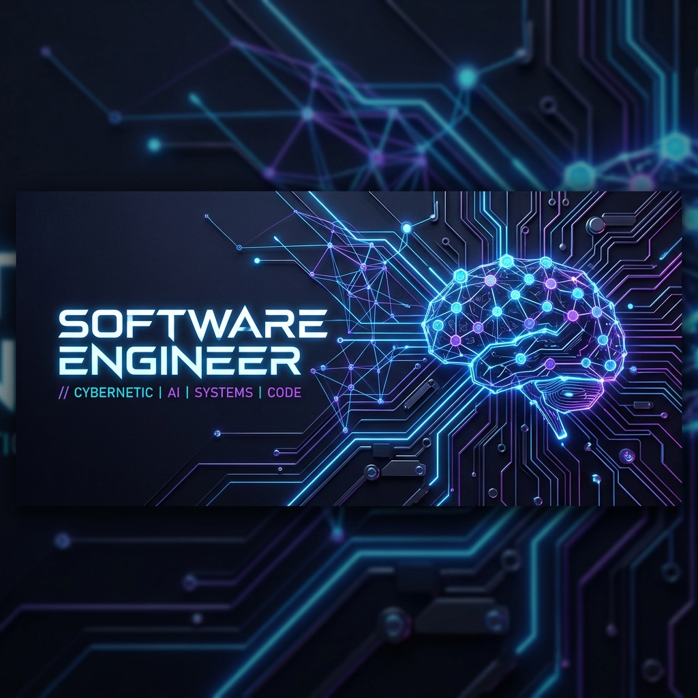

  

 

# 👋 Hi, I'm Nallabati Venkata Durga Sai Sarat Chandra
### AI Engineer | Autonomous Systems Developer | Full Stack Innovator

  

  
  

---

### 🚀 About Me
I'm a passionate developer specializing in **Edge AI**, **Neuromorphic/Self-Evolving Systems**, **Autonomous Robotics**, and **Modern UI/UX Design**. I enjoy bridging the gap between hardware constraints and advanced machine intelligence to build robust, highly optimized, real-world solutions.

---

### 🛠️ Tech Stack & Expertise

<table>
  <tr>
    <td align="center" width="25%">
      <strong>🤖 Artificial Intelligence</strong>
    </td>
    <td align="left">
      
      
      
      
      
    </td>
  </tr>
  <tr>
    <td align="center">
      <strong>💻 Languages</strong>
    </td>
    <td align="left">
      
      
      
      
      
    </td>
  </tr>
  <tr>
    <td align="center">
      <strong>⚡ Robotics & IoT</strong>
    </td>
    <td align="left">
      
      
      
      
    </td>
  </tr>
  <tr>
    <td align="center">
      <strong>🎨 Web & UI/UX</strong>
    </td>
    <td align="left">
      
      
      
      
    </td>
  </tr>
</table>

---

### 🔥 Featured Projects

#### 🌟 [Evolution Edge](https://github.com/Sarat-2007/Evolution-Edge)
> **Self-Evolving Edge AI Routing Engine**
> A dynamic neuro-symbolic routing engine that elevates local edge models (Qwen/Llama) using a *lifelong learning pipeline*. Queries that exceed edge capability automatically route to AMD Instinct MI300X cloud teacher systems, returning a "Knowledge Packet" that updates the edge's semantic memory!

#### 🏎️ [Bluetooth Autonomous Mobile Robot](https://github.com/Sarat-2007/Bluetooth-Mobile-Robot)
> **Autonomous Rover with Smooth Velocity Profiling**
> An Arduino-based advanced autonomous mobile robot featuring non-blocking smooth acceleration and velocity profiling algorithms for precise mechanical trajectories.

#### 🎮 [Hockey Pro 25](https://github.com/Sarat-2007/Hockey-Pro-25)
> **Tournament Hockey Game**
> A highly polished digital tournament hockey experience showcasing responsive mechanics, smooth animations, and game state management.

#### 📡 [Industrial GSM Automation](https://github.com/Sarat-2007/Industrial-GSM-Automation)
> **Remote Home & Industrial Control System**
> Secure, remote hardware automation using A7670C GSM module combined with Arduino for long-range communications and robust relay switching.

---

### 📊 GitHub Dynamics

  
  

  

---

  <i>"Optimizing at the limits of hardware, innovating at the core of software."</i>

